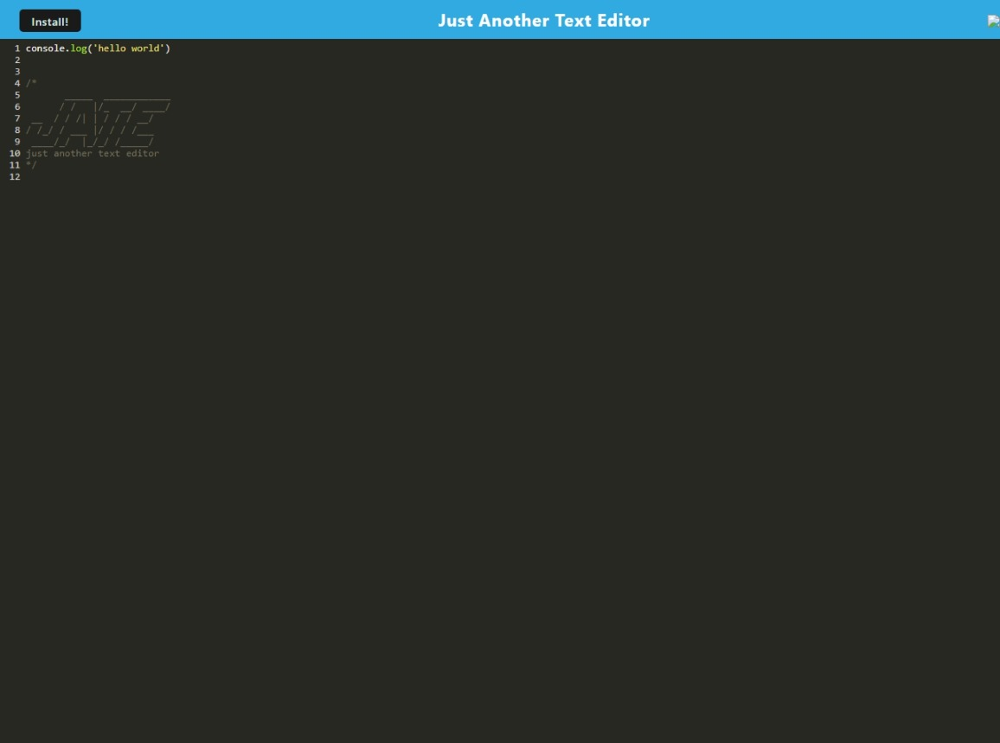
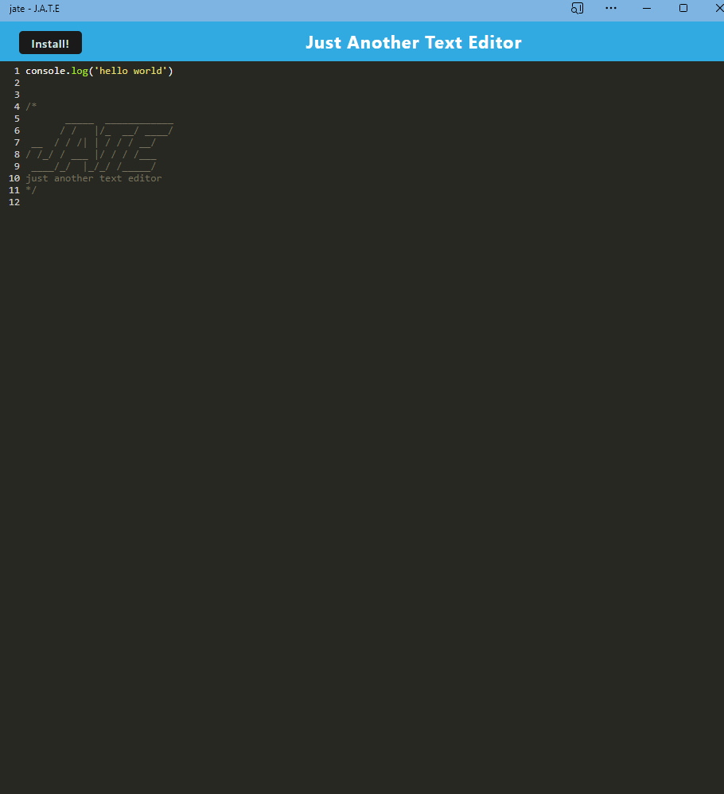

# text-editor

## Table of Contents

[Description](#description)

[Installation](#installation)

[Usage](#usage)

[Images](#images)

[URLs](#urls)

## Description

This is a simple text editor, useful for on-the-go programmers who just need to get those snippets of code out of their head. It can be installed for offline use and will store the previous session's data so that the code is not lost upon closing the application.

## Installation

### Installing from GitHub:

1. Clone the GitHub repository.

2. Use the command line to run "run npm install" to download all the required packages.

3. Use the command line to run "run npm start" to compile and launch teh application.

4. Open a browser tab to localhost:3000 to use it.

### Installing from Deployed App:

1. Click the install button in the top left corner.

## Usage

Users can type whatever they like into the text editor, and the app will store the information between sessions. It is up to each user what they would like to use it for. HTML, JS, Python, the potential is endless.

## Images

I used the application, restarted my computer, then relaunched the application both on the web and as an offline app. The single line of code I wrote before restarting my computer persisted.

Here's an image of the web version of the application:

Here is an image of the application in offline app mode:

## URLs

GitHub Repo: https://github.com/Shippo704/text-editor

Deployed Heroku App: https://polar-depths-17082-ab74c82ef2ec.herokuapp.com/